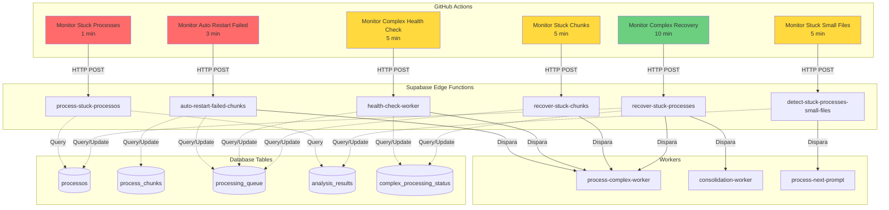
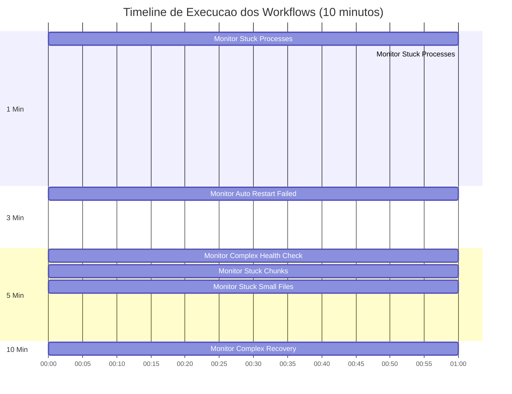
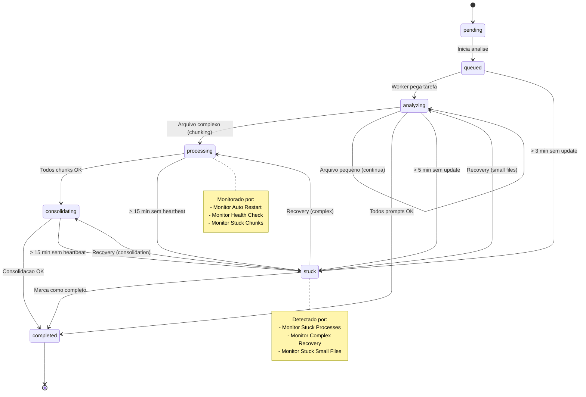
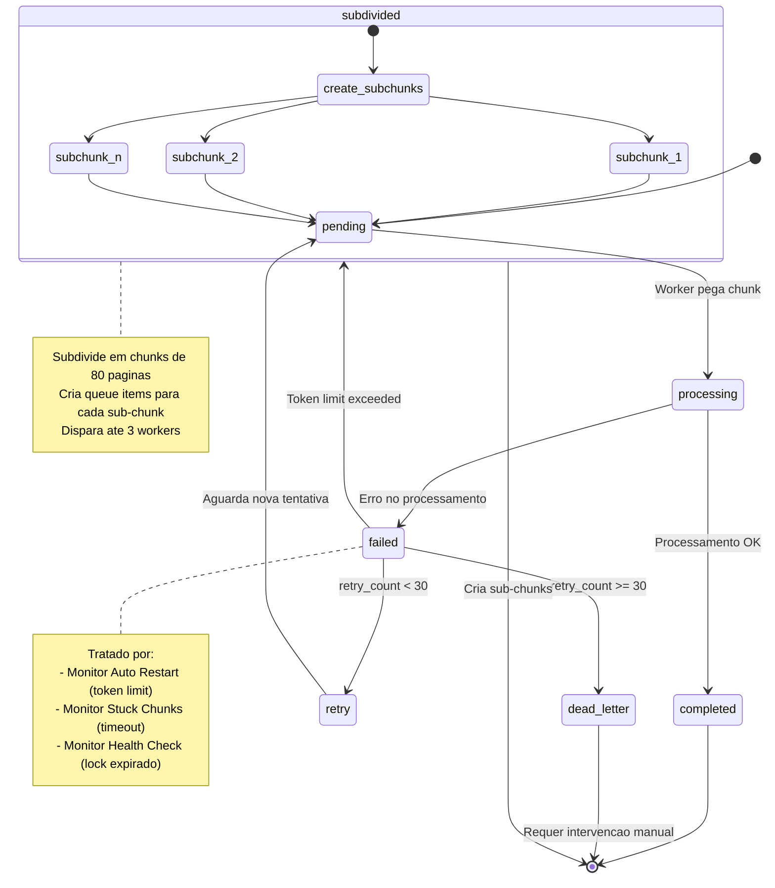
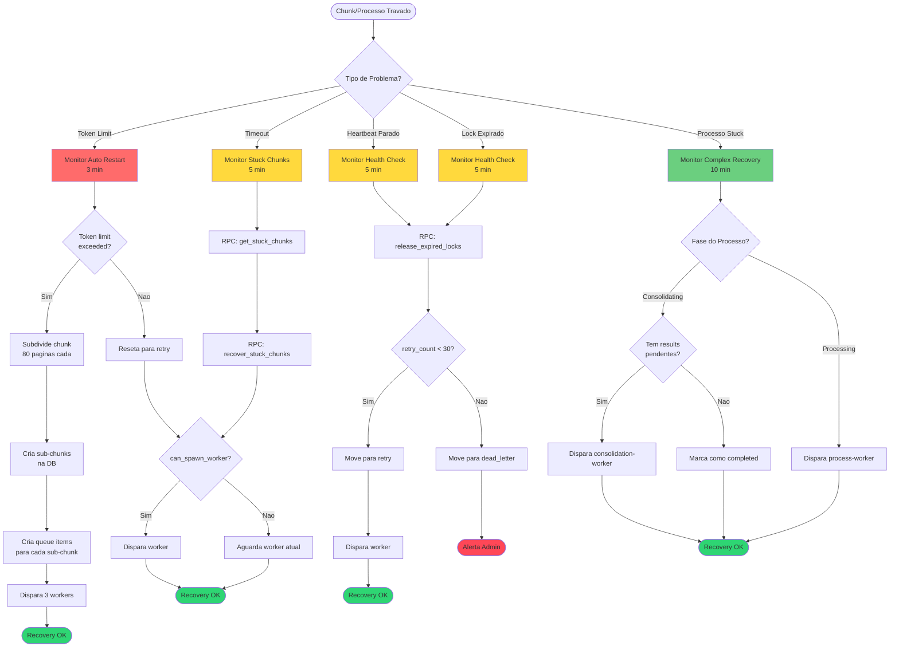
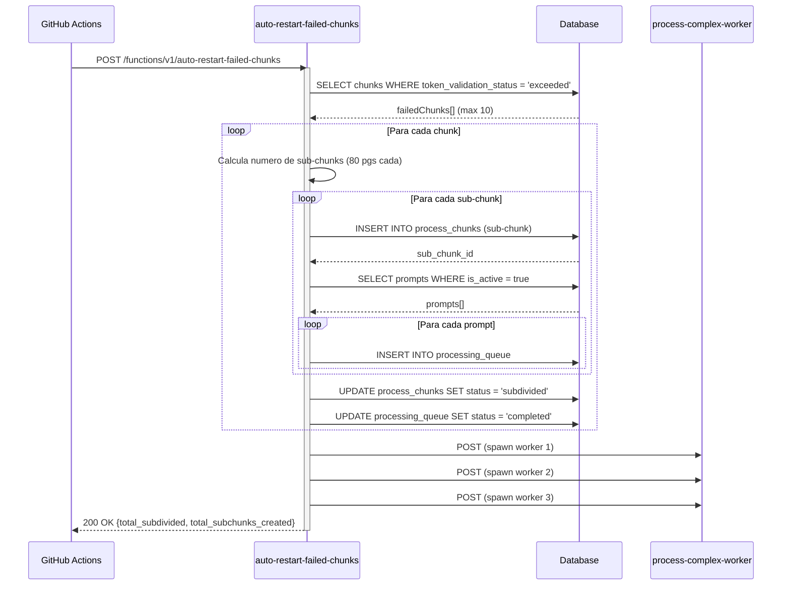
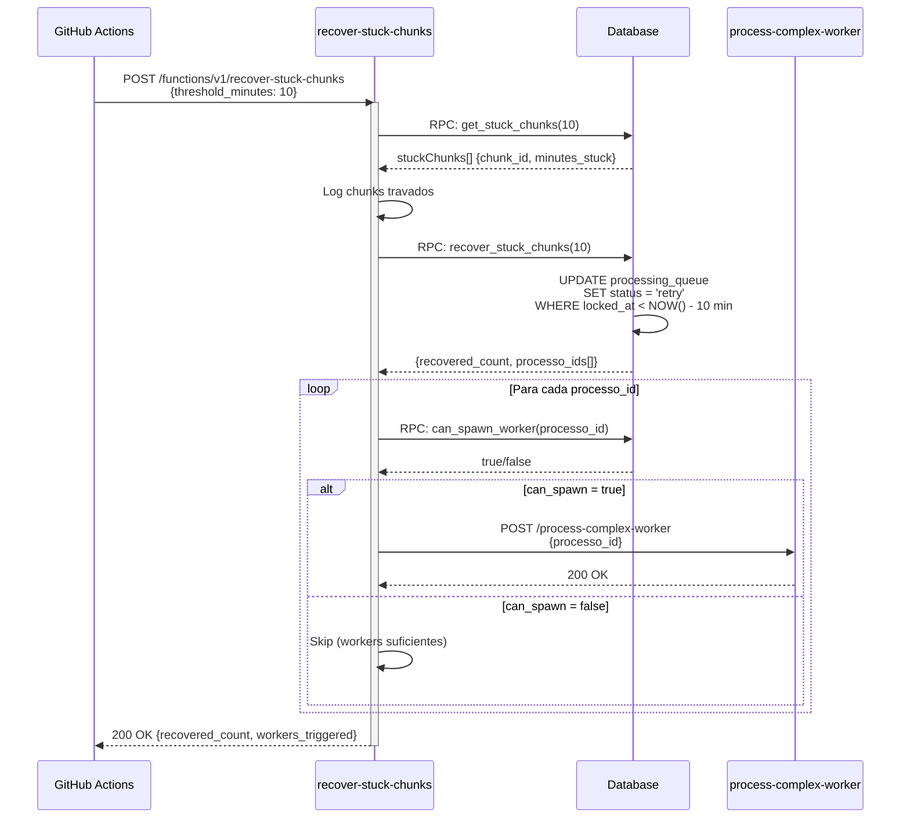
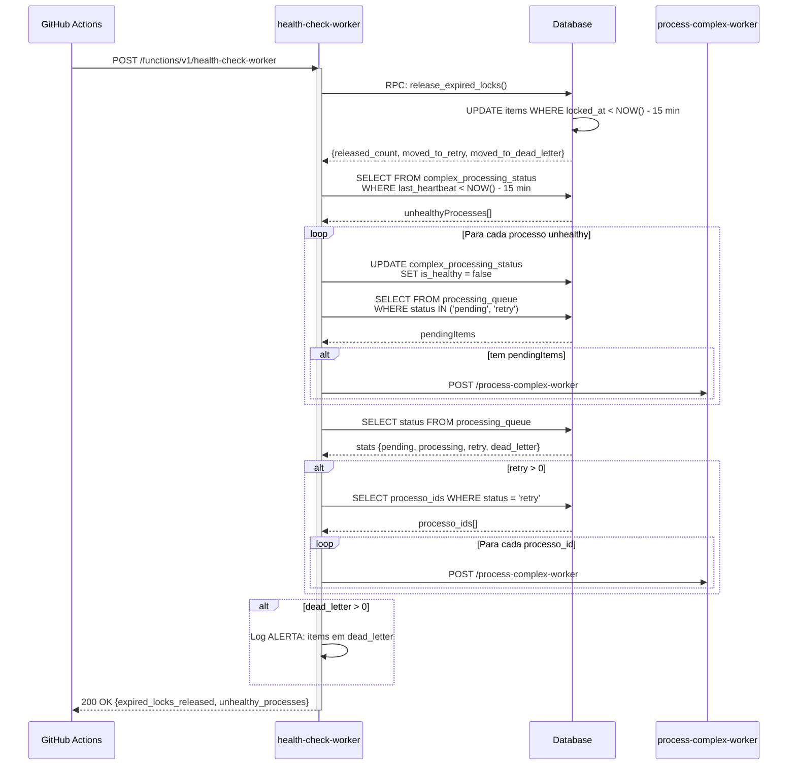
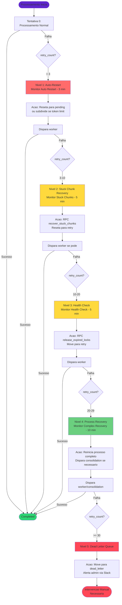
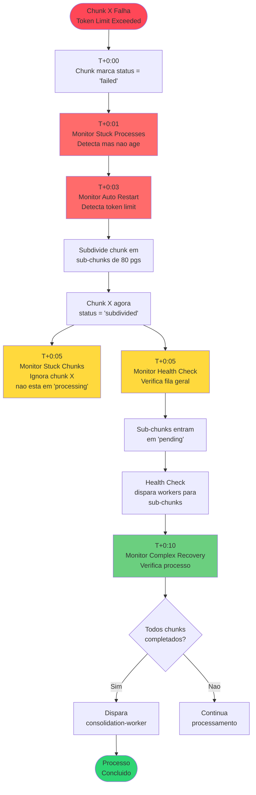

# Arquitetura Visual dos Workflows - Diagramas Mermaid

Visualizacoes detalhadas da arquitetura, fluxos e interacoes do sistema de monitoramento automatizado.

---

## Indice

1. [Arquitetura Geral do Sistema](#arquitetura-geral-do-sistema)
2. [Timeline de Execucao](#timeline-de-execucao)
3. [Maquina de Estados - Processos](#maquina-de-estados---processos)
4. [Maquina de Estados - Chunks](#maquina-de-estados---chunks)
5. [Fluxo de Decisao para Recovery](#fluxo-de-decisao-para-recovery)
6. [Sequencia de Interacoes](#sequencia-de-interacoes)
7. [Estrategia de Escalacao](#estrategia-de-escalacao)
8. [Fluxos Detalhados por Workflow](#fluxos-detalhados-por-workflow)

---

## Arquitetura Geral do Sistema



---

## Timeline de Execucao



---

## Maquina de Estados - Processos



---

## Maquina de Estados - Chunks



---

## Fluxo de Decisao para Recovery



---

## Sequencia de Interacoes

### Workflow: Monitor Auto Restart Failed



### Workflow: Monitor Stuck Chunks



### Workflow: Monitor Complex Health Check



---

## Estrategia de Escalacao



---

## Fluxos Detalhados por Workflow

### 1. Monitor Stuck Processes

```mermaid
graph TD
    Start([Executa a cada 1 min]) --> Query1[SELECT processos<br/>WHERE status = 'analyzing'<br/>AND analysis_started_at < NOW() - 5 min]

    Query1 --> Query2[SELECT processos<br/>WHERE status = 'queued'<br/>AND updated_at < NOW() - 3 min]

    Query2 --> Combine[Combina resultados]

    Combine --> Loop{Para cada<br/>processo}

    Loop -->|Sim| CheckPending[SELECT analysis_results<br/>WHERE status IN ('pending', 'processing')]

    CheckPending --> HasPending{Tem<br/>pendentes?}

    HasPending -->|Nao| MarkComplete[UPDATE processos<br/>SET status = 'completed']
    MarkComplete --> Result1[Adiciona a completed_count]
    Result1 --> Loop

    HasPending -->|Sim| MarkStuck[Classifica como 'stuck'<br/>needs_user_action = true]
    MarkStuck --> Result2[Adiciona a stuck_count]
    Result2 --> Loop

    Loop -->|Nao| Return[Retorna:<br/>- completed_count<br/>- stuck_count<br/>- stuck_processos[]]

    Return --> End([Fim])

    note1[OBSERVACAO:<br/>Este workflow NAO<br/>reinicia processos.<br/>Apenas detecta e reporta.]

    style Start fill:#ff6b6b
    style note1 fill:#fff3cd
    style End fill:#2ed573
```

### 2. Monitor Auto Restart Failed Chunks

```mermaid
graph TD
    Start([Executa a cada 3 min]) --> Query[SELECT process_chunks<br/>WHERE token_validation_status = 'exceeded'<br/>AND status = 'failed'<br/>AND subdivision_parent_id IS NULL<br/>LIMIT 10]

    Query --> CheckEmpty{Tem chunks?}
    CheckEmpty -->|Nao| ReturnEmpty[Retorna: count = 0]
    CheckEmpty -->|Sim| LoopChunks{Para cada<br/>chunk}

    LoopChunks -->|Sim| CalcSubchunks[Calcula numero de sub-chunks<br/>subChunkSize = 80 paginas]

    CalcSubchunks --> LoopSubchunks{Para cada<br/>sub-chunk}

    LoopSubchunks -->|Sim| CreateSubchunk[INSERT process_chunks<br/>- start_page<br/>- end_page<br/>- subdivision_parent_id<br/>- estimated_tokens]

    CreateSubchunk --> GetPrompts[SELECT analysis_prompts<br/>WHERE is_active = true]

    GetPrompts --> LoopPrompts{Para cada<br/>prompt}

    LoopPrompts -->|Sim| CreateQueueItem[INSERT processing_queue<br/>- chunk_id<br/>- prompt_id<br/>- priority = 10]

    CreateQueueItem --> LoopPrompts
    LoopPrompts -->|Nao| LoopSubchunks

    LoopSubchunks -->|Nao| MarkSubdivided[UPDATE process_chunks<br/>SET status = 'subdivided'<br/>WHERE id = chunk_id]

    MarkSubdivided --> UpdateQueue[UPDATE processing_queue<br/>SET status = 'completed'<br/>WHERE chunk_id = chunk_id]

    UpdateQueue --> AddResult[Adiciona a results[]]

    AddResult --> LoopChunks

    LoopChunks -->|Nao| SpawnWorkers[Dispara ate 3 workers:<br/>process-complex-worker]

    SpawnWorkers --> Return[Retorna:<br/>- total_subdivided<br/>- total_subchunks_created<br/>- results[]]

    Return --> End([Fim])
    ReturnEmpty --> End

    style Start fill:#ff6b6b
    style End fill:#2ed573
```

### 3. Monitor Complex Health Check

```mermaid
graph TD
    Start([Executa a cada 5 min]) --> ReleaseLocksRPC[RPC: release_expired_locks]

    ReleaseLocksRPC --> LogRelease[Log: locks liberados<br/>moved_to_retry<br/>moved_to_dead_letter]

    LogRelease --> QueryUnhealthy[SELECT complex_processing_status<br/>WHERE current_phase IN ('processing', 'queued')<br/>AND last_heartbeat < NOW() - 15 min]

    QueryUnhealthy --> CheckUnhealthy{Tem processos<br/>unhealthy?}

    CheckUnhealthy -->|Sim| LoopUnhealthy{Para cada<br/>processo}

    LoopUnhealthy -->|Sim| MarkUnhealthy[UPDATE complex_processing_status<br/>SET is_healthy = false]

    MarkUnhealthy --> CheckPending[SELECT processing_queue<br/>WHERE status IN ('pending', 'retry')]

    CheckPending --> HasPending{Tem<br/>pendentes?}

    HasPending -->|Sim| SpawnWorker1[Dispara process-complex-worker]
    SpawnWorker1 --> LoopUnhealthy

    HasPending -->|Nao| LoopUnhealthy

    LoopUnhealthy -->|Nao| QueryStats
    CheckUnhealthy -->|Nao| QueryStats[SELECT status<br/>FROM processing_queue]

    QueryStats --> CountStats[Conta por status:<br/>- pending<br/>- processing<br/>- retry<br/>- dead_letter]

    CountStats --> LogStats[Log estatisticas da fila]

    LogStats --> CheckRetry{retry > 0?}

    CheckRetry -->|Sim| GetRetryProcessos[SELECT DISTINCT processo_id<br/>WHERE status = 'retry'<br/>LIMIT 5]

    GetRetryProcessos --> LoopRetry{Para cada<br/>processo}

    LoopRetry -->|Sim| SpawnWorker2[Dispara process-complex-worker]
    SpawnWorker2 --> LoopRetry

    LoopRetry -->|Nao| CheckDeadLetter
    CheckRetry -->|Nao| CheckDeadLetter{dead_letter > 0?}

    CheckDeadLetter -->|Sim| LogDeadLetter[Log ALERTA:<br/>Lista primeiros 10 items<br/>com ID, processo, tentativas, erro]

    LogDeadLetter --> Return
    CheckDeadLetter -->|Nao| Return[Retorna:<br/>- expired_locks_released<br/>- unhealthy_processes]

    Return --> End([Fim])

    style Start fill:#ffd93d
    style End fill:#2ed573
```

### 4. Monitor Stuck Chunks

```mermaid
graph TD
    Start([Executa a cada 5 min]) --> GetStuckRPC[RPC: get_stuck_chunks<br/>threshold_minutes = 10]

    GetStuckRPC --> LogStuck[Log chunks travados:<br/>- chunk_id<br/>- status<br/>- attempt_number<br/>- minutes_stuck]

    LogStuck --> CheckEmpty{Tem chunks?}

    CheckEmpty -->|Nao| ReturnEmpty[Retorna: recovered_count = 0]

    CheckEmpty -->|Sim| RecoverRPC[RPC: recover_stuck_chunks<br/>threshold_minutes = 10]

    RecoverRPC --> GetResult[Recebe:<br/>- recovered_count<br/>- processo_ids[]]

    GetResult --> LogRecovered[Log: N chunks recuperados<br/>M processos afetados]

    LogRecovered --> LoopProcessos{Para cada<br/>processo_id}

    LoopProcessos -->|Sim| CanSpawnRPC[RPC: can_spawn_worker<br/>processo_id]

    CanSpawnRPC --> CheckCanSpawn{Pode spawnar?}

    CheckCanSpawn -->|Sim| SpawnWorker[Dispara process-complex-worker<br/>processo_id]
    SpawnWorker --> IncrementWorkers[workers_triggered++]
    IncrementWorkers --> LogSpawned[Log: Worker disparado]
    LogSpawned --> LoopProcessos

    CheckCanSpawn -->|Nao| LogSkip[Log: Processo ja tem workers suficientes]
    LogSkip --> LoopProcessos

    LoopProcessos -->|Nao| Return[Retorna:<br/>- stuck_found<br/>- recovered_count<br/>- processos_affected<br/>- workers_triggered<br/>- processo_ids[]]

    Return --> End([Fim])
    ReturnEmpty --> End

    style Start fill:#ffd93d
    style End fill:#2ed573
```

### 5. Monitor Stuck Small Files

```mermaid
graph TD
    Start([Executa a cada 5 min]) --> Query[SELECT analysis_results<br/>JOIN processos<br/>WHERE analysis_results.status = 'processing'<br/>AND processing_at < NOW() - 10 min<br/>AND processos.is_chunked = false<br/>AND processos.status = 'analyzing']

    Query --> CheckEmpty{Tem prompts?}

    CheckEmpty -->|Nao| ReturnEmpty[Retorna: recovered = 0]

    CheckEmpty -->|Sim| CreateSet[Cria Set para deduplic<br/>processedProcessos = new Set]

    CreateSet --> LoopPrompts{Para cada<br/>prompt}

    LoopPrompts -->|Sim| CheckDupe{processo_id<br/>ja processado?}

    CheckDupe -->|Sim| LoopPrompts

    CheckDupe -->|Nao| AddToSet[Adiciona a processedProcessos]

    AddToSet --> LogRecovering[Log: Recuperando processo<br/>- processo_id<br/>- file_name<br/>- prompt_title<br/>- processing_at]

    LogRecovering --> ResetPrompts[UPDATE analysis_results<br/>SET status = 'pending'<br/>processing_at = NULL<br/>WHERE processo_id = X]

    ResetPrompts --> SpawnWorker[Dispara process-next-prompt<br/>processo_id]

    SpawnWorker --> CheckSuccess{Sucesso?}

    CheckSuccess -->|Sim| AddRecovered[Adiciona a recovered[]<br/>action = 'processing_restarted']
    AddRecovered --> LoopPrompts

    CheckSuccess -->|Nao| AddFailed[Adiciona a failed[]<br/>com erro]
    AddFailed --> LoopPrompts

    LoopPrompts -->|Nao| Return[Retorna:<br/>- message<br/>- recovered[]<br/>- failed[]]

    Return --> End([Fim])
    ReturnEmpty --> End

    style Start fill:#ffd93d
    style End fill:#2ed573
```

### 6. Monitor Complex Recovery

```mermaid
graph TD
    Start([Executa a cada 10 min]) --> Query[SELECT complex_processing_status<br/>WHERE current_phase IN ('consolidating', 'processing')<br/>AND last_heartbeat < NOW() - 15 min]

    Query --> CheckEmpty{Tem processos?}

    CheckEmpty -->|Nao| ReturnEmpty[Retorna: recovered = 0]

    CheckEmpty -->|Sim| LoopProcessos{Para cada<br/>processo}

    LoopProcessos -->|Sim| LogRecovering[Log: Recuperando processo<br/>- processo_id<br/>- current_phase<br/>- last_heartbeat<br/>- chunks_completed/total]

    LogRecovering --> CheckPhase{Fase?}

    CheckPhase -->|consolidating| CheckPendingResults
    CheckPhase -->|processing + all chunks done| CheckPendingResults[SELECT analysis_results<br/>WHERE status IN ('pending', 'processing')]

    CheckPendingResults --> HasPending{Tem<br/>pendentes?}

    HasPending -->|Sim| SpawnConsolidation[Dispara consolidation-worker]
    SpawnConsolidation --> AddRecovered1[Adiciona a recovered[]<br/>action = 'consolidation_restarted']
    AddRecovered1 --> UpdateHeartbeat

    HasPending -->|Nao| MarkComplete[UPDATE processos<br/>SET status = 'completed'<br/>analysis_completed_at = NOW()]
    MarkComplete --> UpdateStatus[UPDATE complex_processing_status<br/>SET current_phase = 'completed'<br/>overall_progress_percent = 100]
    UpdateStatus --> AddRecovered2[Adiciona a recovered[]<br/>action = 'marked_completed']
    AddRecovered2 --> UpdateHeartbeat

    CheckPhase -->|processing| SpawnWorker[Dispara process-complex-worker]
    SpawnWorker --> AddRecovered3[Adiciona a recovered[]<br/>action = 'processing_restarted']
    AddRecovered3 --> UpdateHeartbeat[UPDATE complex_processing_status<br/>SET last_heartbeat = NOW()]

    UpdateHeartbeat --> LoopProcessos

    LoopProcessos -->|Nao| Return[Retorna:<br/>- message<br/>- recovered[]<br/>- failed[]]

    Return --> End([Fim])
    ReturnEmpty --> End

    style Start fill:#6bcf7f
    style End fill:#2ed573
```

---

## Coordenacao Entre Workflows



---

## Legenda de Cores

- **Vermelho** (ff6b6b): Workflows de alta prioridade (1-3 min)
- **Amarelo** (ffd93d): Workflows de media prioridade (5 min)
- **Verde** (6bcf7f): Workflows de baixa prioridade (10 min)
- **Verde Escuro** (2ed573): Estados de sucesso
- **Vermelho Escuro** (ff4757): Estados de erro/alerta

---

[Voltar: GitHub Actions Monitoring](./github-actions-monitoring.md) | [Proximo: README →](../README.md)
